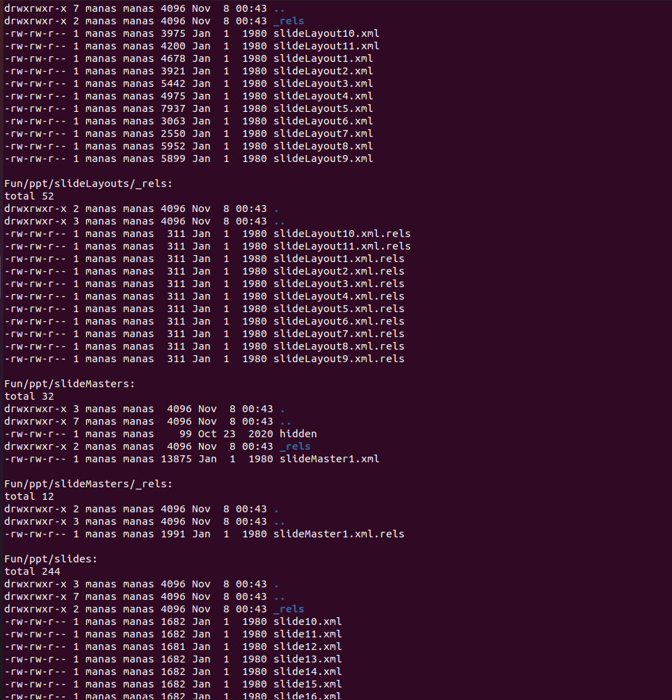

# MacroHard WeakEdge
## Description
I've hidden a flag in this file. Can you find it? [Forensics is fun.pptm](https://mercury.picoctf.net/static/c0da20f29337e87ffb58ea987d8c596e/Forensics%20is%20fun.pptm)
### Type: Forensics

## Solving:
1) I downloaded the given file and opened it. My system gave me a warning that it contains macros.
2) I know that pptm files are basically zip files so i can extract it.
3) I extracted in a folder called fun.
4) Then through cmd I listed all files recursively

		ls Fun -alR
		

5) Then inspected the library and found that there is a file called hidden, So i concatted that file and got a random sequence of letters which looked like a cypher.
6) So I examined the cypher which contained capital letters, small letters and numbers which seemed like a base64 cypher.
7) I used the online tool [base64decoder](https://www.base64decode.org/)
to decypher the text.

8) I got the flag on decoding the cypher.

**Flag: picoCTF{D1d_u_kn0w_ppts_r_z1p5}**