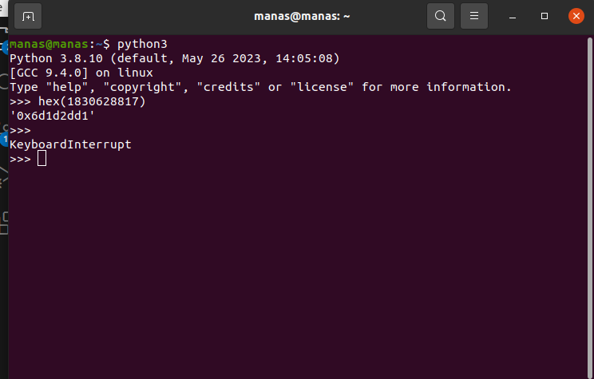

# ARMssembly
## Description
What integer does this program print with arguments `1765227561` and `1830628817`? File: [chall.S](./ARMssenbly%20resources/chall.S) Flag format: `picoCTF{XXXXXXXX}` -> (hex, lowercase, no 0x, and 32 bits. ex. 5614267 would be `picoCTF{0055aabb}`)
## Type: Reverse Engineering
## Solving
1) I inspected the file [`chall.S`](./ARMssenbly%20resources/chall.S) which was in Assembly.

```ARM 
	.arch armv8-a
	.file	"chall.c"
	.text
	.align	2
	.global	func1
	.type	func1, %function
func1:
	sub	sp, sp, #16
	str	w0, [sp, 12] ; w0 = 1765227561 It is storing w0 to [sp +12]
	str	w1, [sp, 8]  ; w1 = 1830628817 It is storitn w1 to [sp + 8]
	ldr	w1, [sp, 12] ; w1 = 1765227561 
	ldr	w0, [sp, 8] ; w0 = 1830628817
	cmp	w1, w0 ; if w1<=w0 then go to L2 (True)
	bls	.L2 ; w0 = 1830628817
	ldr	w0, [sp, 12]
	b	.L3
.L2:
	ldr	w0, [sp, 8] ; w0 = 1830628817
.L3:
	add	sp, sp, 16 ; sp = sp+16 = Stack Frame Destruction = Function Epilogue
	ret
	.size	func1, .-func1
	.section	.rodata
	.align	3
.LC0:
	.string	"Result: %ld\n"
	.text
	.align	2
	.global	main
	.type	main, %function
main:
	stp	x29, x30, [sp, -48]! ;
	add	x29, sp, 0
	str	x19, [sp, 16]
	str	w0, [x29, 44] ;argc
	str	x1, [x29, 32] ; argv
	ldr	x0, [x29, 32] ;x0 = argv
	add	x0, x0, 8 ; x0 = x0 +8 = argv[1]
	ldr	x0, [x0] ; x0 = "1765227561"
	bl	atoi
	mov	w19, w0 ; w19 = 1765227561
	ldr	x0, [x29, 32] ; x0 = argv
	add	x0, x0, 16 ; x0 = x0 + 16 = argv[2]
	ldr	x0, [x0] ; x0 = "1830628817"
	bl	atoi
	mov	w1, w0 ; w1 = 1830628817
	mov	w0, w19 ; w0 = 1765227561
	bl	func1 ; go to func1
	mov	w1, w0 ; w1 = w0 = 1830628817
	adrp	x0, .LC0
	add	x0, x0, :lo12:.LC0
	bl	printf ; 1830628817
	mov	w0, 0
	ldr	x19, [sp, 16]
	ldp	x29, x30, [sp], 48
	ret
	.size	main, .-main
	.ident	"GCC: (Ubuntu/Linaro 7.5.0-3ubuntu1~18.04) 7.5.0"
	.section	.note.GNU-stack,"",@progbits

```
2) I commented out the steps line by line and got the number to be converted to hex and submitted as flag.
3) I converted `1830628817` to hex using python in cmd

        hex(1830628817)


4) I got `0x6d1d2dd1` as answer in which I have to omit `0x` and submit it as flag.

        Flag: picoCTF{6d1d2dd1}
